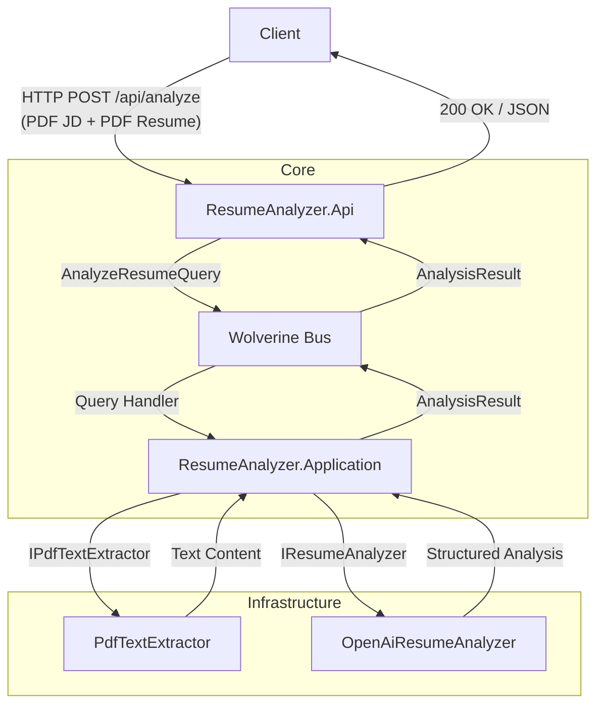
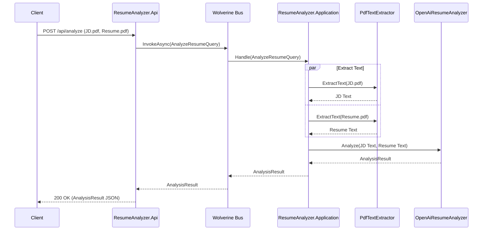

# Resume Analyzer

| Build | Coverage |
| --- | --- |
|  |  |

---

## High-Level Architecture

---

## Sequence Diagram

---

## Component Overview

| Project | Description |
| :--- | :--- |
| **ResumeAnalyzer.Api** | Entry point. Validates and accepts multipart/form-data containing two PDF files: the Job Description (JD) and the Resume. Dispatches queries via Wolverine. |
| **ResumeAnalyzer.Application** | Core business logic. Coordinates PDF extraction for both files and performs LLM analysis comparing them. |
| **ResumeAnalyzer.Infrastructure** | Concrete implementations for external services (PDF processing, OpenAI integration). |
| **ResumeAnalyzer.Domain** | Shared models and domain entities. |
| **ResumeAnalyzer.AppHost** | .NET Aspire orchestration. |
