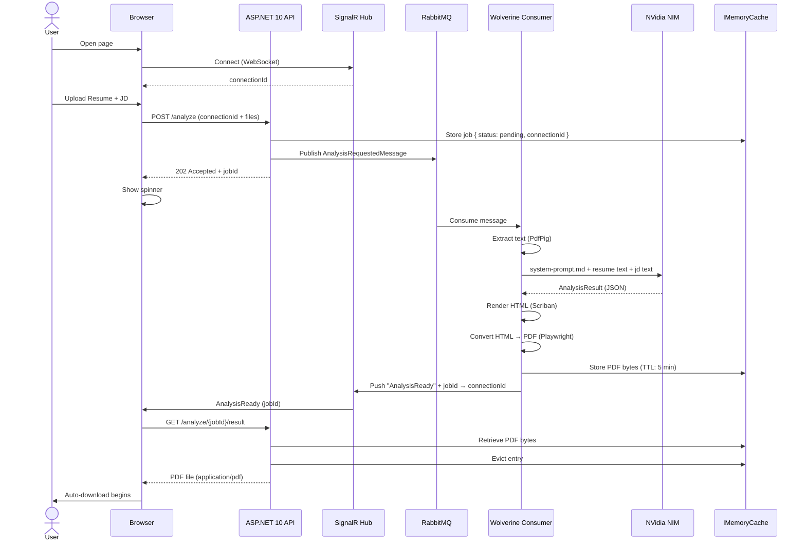
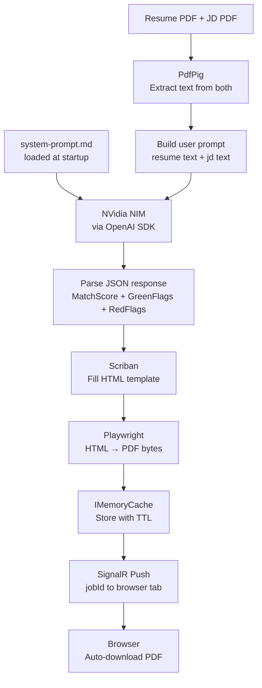

# Resume Analyzer — Architecture Decision Record

## What Are We Building?

A lightweight, anonymous web API that accepts a **Resume** and a **Job Description (JD)** as PDF files, runs an AI-powered analysis, and returns a structured PDF report as an automatic browser download.

The system is **domain-agnostic**. It works for any role, in any industry, at any seniority level. The JD is the sole source of truth — the AI infers the role, the expected skills, the seniority signals, and the evaluation criteria entirely from its content. If the JD is well-written, the analysis will be meaningful whether the role is a hotel executive chef, a fighter pilot, or a software architect.

> **Current use case (example only):** An internal hiring team evaluating candidates for Full Stack .NET engineering roles (SD2 / SD3 / SD4). This is not hardcoded into the system in any way.

---

## What Does the Report Contain?

| Section | Description |
|---|---|
| **Match Score** | Resume-JD match as a percentage |
| **Green Flags** | Positive signals — both generic (career trajectory) and JD-specific (skills, domain, leadership) |
| **Red Flags** | Concern signals — both generic and JD-specific |

Both green and red flags are evaluated across the **same shared dimensions** (see AI Prompt Strategy below). The AI decides which side each dimension falls on per candidate — it can produce a green flag, a red flag, both, or neither for any given dimension.

---

## API Contract

```
POST /analyze
  Body: multipart/form-data
    - resume  (PDF file)
    - jd      (PDF file)

Response: 202 Accepted
  Body: { "jobId": "<guid>" }
```

No role label, no seniority level, no industry hint. The JD carries all of that context. The AI reads both documents and evaluates accordingly.

---

## Tech Stack

| Concern | Choice | Reason |
|---|---|---|
| Framework | ASP.NET 10 Web API (Controller-based) | Personal preference |
| Mediator | Wolverine | Handles in-process dispatch and message consumption under one roof |
| Message Queue | RabbitMQ (via Wolverine transport) | Decouples HTTP layer from slow AI processing; retry + dead-letter built in |
| PDF Reading | PdfPig | Free, MIT licensed, pure .NET, no native dependencies |
| HTML Templating | Scriban | Lightweight, logic-capable, .NET native |
| CSS | Tailwind CLI (pre-compiled, inlined at build time) | Write Tailwind in dev; inline raw CSS into template before commit; no runtime CDN |
| PDF Generation | Playwright (headless Chromium, HTML → PDF) | Faithful HTML/CSS rendering; handles pre-inlined CSS well |
| AI Provider | NVidia NIM (free tier) via OpenAI .NET SDK | OpenAI-compatible API; free tier sufficient for dev/test (40 rpm) |
| Notification | SignalR (WebSocket push) | Push result directly to the waiting browser tab |
| Temporary Storage | `IMemoryCache` (ASP.NET built-in) | PDF bytes held briefly; evicted immediately after download |
| Auth | None — fully anonymous | No login, no registration, no identity |
| Database | None | No persistence required |
| External Storage | None | No file system, no blob storage, no Redis, no cloud |

---

## Key Architectural Decisions

### 1. Domain Agnostic by Design
The system has zero hardcoded knowledge of roles, industries, or tech stacks. All evaluation context comes from the JD. Swapping the JD is all that's needed to analyse a completely different role in a completely different domain.

### 2. No Persistence
The JD and Resume PDFs are **never written to disk**. They flow as `MemoryStream` objects through the pipeline. The output PDF is held in `IMemoryCache` only long enough for the browser to download it, then evicted immediately.

### 3. Async Processing via RabbitMQ + Wolverine
AI inference is slow and rate-limited (NVidia NIM free tier: 40 rpm). The HTTP request returns `202 Accepted` immediately. Processing happens in a Wolverine message handler consuming from RabbitMQ.

### 4. SignalR for Auto-Download
The browser connects to a SignalR hub on page load and receives a `connectionId`. This is submitted alongside the files. When the worker finishes, it pushes the `jobId` to that specific tab. The JS handler immediately fires `GET /analyze/{jobId}/result`, which the browser treats as a file download.

From the user's perspective: **upload → wait → PDF downloads automatically.**

### 5. Closed-Tab Behaviour
If the user closes the tab before the result is ready, the SignalR connection is lost and the result is undeliverable. This is **acceptable and by design**. The UI displays a warning: *"Do not close this tab while analysis is running."* No engineering mitigation is applied.

### 6. AI Provider Abstraction
The AI provider is hidden behind `IResumeAnalysisProvider`. Swapping from NVidia NIM to OpenAI, Azure OpenAI, Anthropic, or any other provider requires only a registration change — nothing else in the pipeline changes.

### 7. PDF Generation via Pre-compiled Tailwind
Tailwind is not loaded at runtime. The developer runs the Tailwind CLI locally, generates a `styles.css` from the HTML template, and inlines it into the template file. This compiled template is committed to source control. The app reads it once at startup and caches it as a singleton string. No CDN, no build step at runtime.

### 8. Light CQRS via Wolverine
- `SubmitAnalysisCommand` → validates input, publishes message to RabbitMQ, returns `202`
- `AnalysisRequestedMessage` → Wolverine consumer; runs the full pipeline
- `GetAnalysisResultQuery` → reads from `IMemoryCache`, streams PDF bytes

### 9. Evaluation Rubric as a Markdown File
The AI's evaluation rubric (flag dimensions, scoring guidance, output format instructions) lives in a `.md` file embedded in the project — **not hardcoded in C#**. It is read once at startup and cached as a singleton string alongside the HTML template.

Updating the rubric = edit the `.md` file, restart the app. No code changes, no recompilation. The file is human-readable and version-controlled, so any stakeholder can read or contribute to it.

```
ResumeAnalyzer/
└── Prompts/
    └── system-prompt.md
```

---

## Request Flow



---

## Processing Pipeline (Internal)



---

## Project Structure (Planned)

```
ResumeAnalyzer/
├── Api/
│   ├── Controllers/
│   │   └── AnalysisController.cs       # POST /analyze, GET /analyze/{jobId}/result
│   └── Hubs/
│       └── AnalysisHub.cs              # SignalR hub
│
├── Application/
│   ├── Commands/
│   │   └── SubmitAnalysisCommand.cs
│   ├── Queries/
│   │   └── GetAnalysisResultQuery.cs
│   ├── Messages/
│   │   └── AnalysisRequestedMessage.cs # Wolverine message (RabbitMQ)
│   ├── Models/
│   │   ├── AnalysisRequest.cs
│   │   ├── AnalysisResult.cs           # MatchScore, GreenFlags, RedFlags
│   │   ├── Flag.cs                     # { Category, Description }
│   │   └── JobResult.cs                # { Status, ConnectionId, PdfBytes }
│   └── Abstractions/
│       ├── IResumeAnalysisProvider.cs  # AI abstraction
│       ├── IReportRenderer.cs          # PDF generation abstraction
│       └── IJobResultStore.cs          # Cache abstraction
│
├── Infrastructure/
│   ├── Ai/
│   │   └── NvidiaAnalysisProvider.cs
│   ├── Pdf/
│   │   ├── PdfTextExtractor.cs         # PdfPig wrapper
│   │   └── PlaywrightReportRenderer.cs # Scriban + Playwright
│   └── Cache/
│       └── MemoryCacheJobResultStore.cs
│
├── Workers/
│   └── AnalysisMessageHandler.cs       # Wolverine consumer
│
├── Prompts/
│   └── system-prompt.md                # Evaluation rubric — edit to change AI behaviour
│
└── Templates/
    └── report.html                     # Pre-compiled (Tailwind inlined)
```

---

## AI Prompt Strategy

### Prompt Split

| Part | Role | Changes? |
|---|---|---|
| **System prompt** | Defines who the AI is, the evaluation rubric, flag dimensions, output format | Only when rubric needs updating — edit `system-prompt.md` |
| **User prompt** | Resume text + JD text | Every request |

This separation means the evaluation rubric is stable and reusable across every request and every domain. Only the documents change.

### Flag Dimensions

Both green flags and red flags are evaluated across the **same shared dimensions**. The AI determines which side each dimension falls on — or whether it's neutral — based on what the resume actually shows relative to the JD.

| Dimension | What It Evaluates |
|---|---|
| **Stability** | Frequency of job changes, average tenure per role |
| **Career Growth** | Progression in seniority, responsibilities, and scope over time |
| **Employment Gaps** | Unexplained or significant gaps between roles |
| **Consistency** | Alignment between stated skills and demonstrated experience |
| **JD Skill Match** | Coverage of required and preferred skills from the JD |
| **Domain Fit** | Relevance of industry/domain experience to the role |
| **Leadership** | Evidence of ownership, mentoring, or cross-functional influence |
| **Achievements** | Quantified impact vs. responsibility-only descriptions |

### System Prompt (contents of `system-prompt.md`)

```
You are an expert hiring analyst. Your job is to evaluate a candidate's resume
against a provided job description, and return a structured, objective analysis.

## Instructions

- Infer the role, seniority level, required skills, and evaluation criteria
  entirely from the job description. Do not assume any industry or domain.
- Evaluate the candidate across the dimensions listed below.
- For each dimension, determine if the evidence warrants a green flag (positive),
  a red flag (concern), both, or neither.
- Return ONLY a valid JSON object. No prose, no markdown, no code fences.

## Evaluation Dimensions

- Stability:       Frequency of job changes, average tenure per role
- Career Growth:   Progression in seniority, responsibilities, and scope over time
- Employment Gaps: Unexplained or significant gaps between roles
- Consistency:     Alignment between stated skills and demonstrated experience
- JD Skill Match:  Coverage of required and preferred skills from the JD
- Domain Fit:      Relevance of industry/domain experience to the role
- Leadership:      Evidence of ownership, mentoring, or cross-functional influence
- Achievements:    Quantified impact vs. responsibility-only descriptions

## Output Format

{
  "matchPercentage": <int 0-100>,
  "greenFlags": [ { "category": "generic|jd-specific", "description": "<string>" } ],
  "redFlags":   [ { "category": "generic|jd-specific", "description": "<string>" } ]
}

Category values:
- "generic"      → applies to any candidate regardless of role (Stability, Growth, Gaps, Consistency, Achievements)
- "jd-specific"  → derived from the JD content (JD Skill Match, Domain Fit, Leadership)
```

### User Prompt (per request)

```
Resume:
{ResumeText}

Job Description:
{JdText}
```

---

## Constraints & Assumptions

- NVidia NIM free tier: 40 rpm — acceptable for low-frequency internal use
- Single instance deployment — `IMemoryCache` is sufficient, no distributed cache needed
- Closing the browser tab during processing = result is lost. User's responsibility.
- The quality of the analysis is directly proportional to the quality of the JD
- Updating the evaluation rubric requires only editing `system-prompt.md` and restarting the app
- No multi-tenancy, no user accounts, no audit trail, no persistence