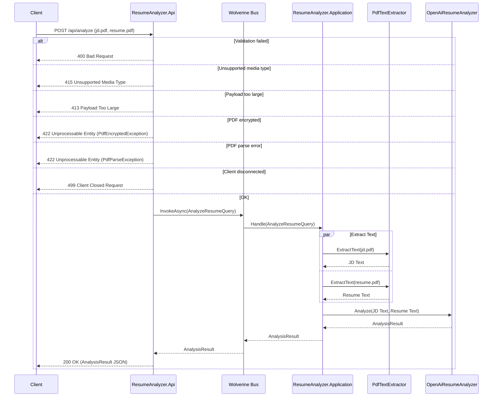

# Endpoints

All responses return JSON. SignalR push is not used — the API is request/response only.

---

## Endpoints Overview

| Endpoint | Method | Purpose |
|----------|--------|---------|
| `/api/analyze` | POST | Analyze a resume against a job description |
| `/health` | GET | Readiness probe |
| `/alive` | GET | Liveness probe |

---

## Interactive Testing

When running locally (dev mode), the API exposes **Swagger UI** at:

> **[/swagger](http://localhost:5222/swagger)**

Use it to explore endpoints and send test requests with auto-generated payloads.

---

## Validation Rules

| Field | Type | Rules |
|-------|------|-------|
| `jd` (form file) | IFormFile | PDF, max 10MB, non-empty |
| `resume` (form file) | IFormFile | PDF, max 10MB, non-empty |

Both files are required. Request must be `multipart/form-data`.

---

## Analyze Resume

`POST /api/analyze`

Takes a Job Description PDF and a Resume PDF, extracts text from both, and uses an LLM to compare them. Returns a structured analysis with match percentage and flags.

### Request

Consumes `multipart/form-data` with two file fields:

| Field | Type | Required | Rules |
|-------|------|----------|-------|
| `jd` | file | yes | `.pdf` only, 1 byte – 10 MB |
| `resume` | file | yes | `.pdf` only, 1 byte – 10 MB |

### Sequence



### Response (200 OK)

```json
{
  "matchPercentage": 72,
  "greenFlags": [
    { "category": "skills", "text": "Strong TypeScript and React experience" },
    { "category": "experience", "text": "5+ years of relevant experience" }
  ],
  "redFlags": [
    { "category": "skills", "text": "Missing required cloud certification" },
    { "category": "education", "text": "No degree in computer science" }
  ]
}
```

| Status Code | Description |
|-------------|-------------|
| 200 | Analysis complete |
| 400 | Validation failed (missing field, wrong type, empty file) |
| 413 | Payload too large (max 11 MB) |
| 415 | Not a multipart/form-data request |
| 422 | PDF encrypted or unparseable |
| 499 | Client disconnected before completion |

---

## Health Checks

| Route | Purpose |
|-------|---------|
| `GET /health` | Readiness probe (Aspire default) |
| `GET /alive` | Liveness probe (Aspire default) |
